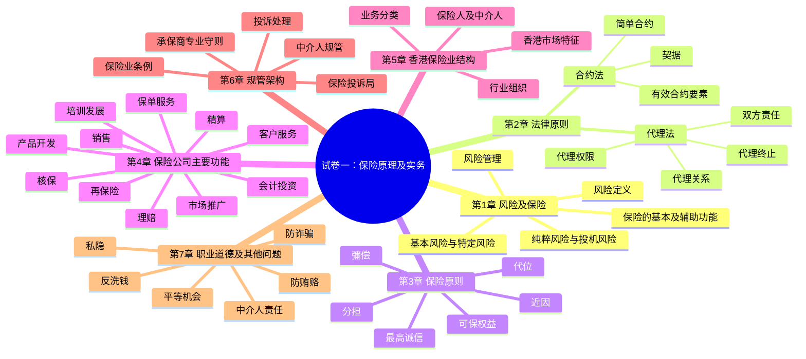
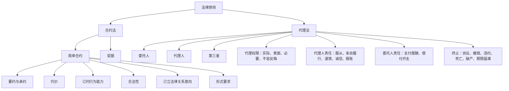
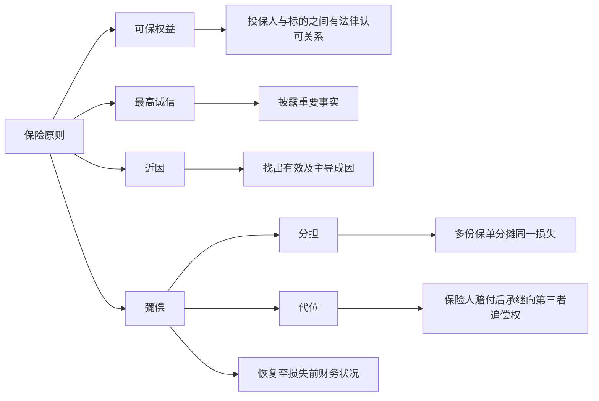
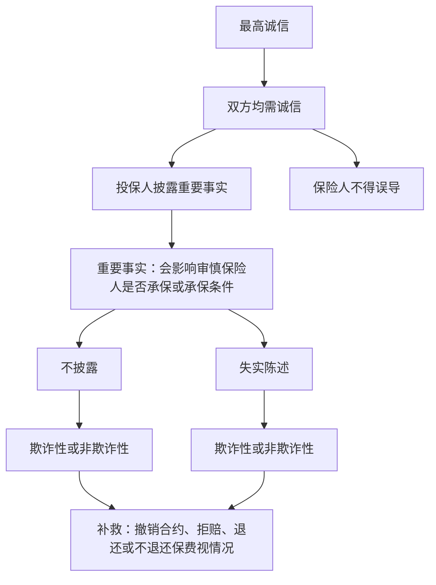
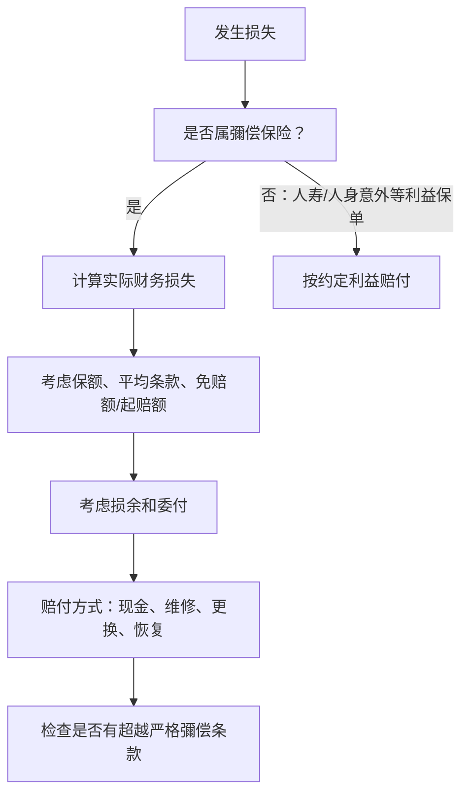
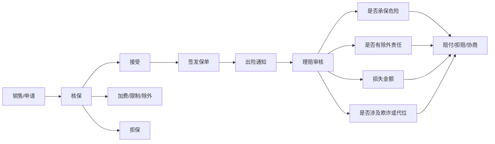
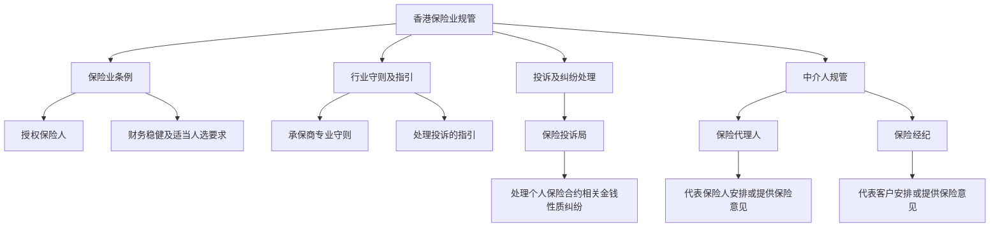
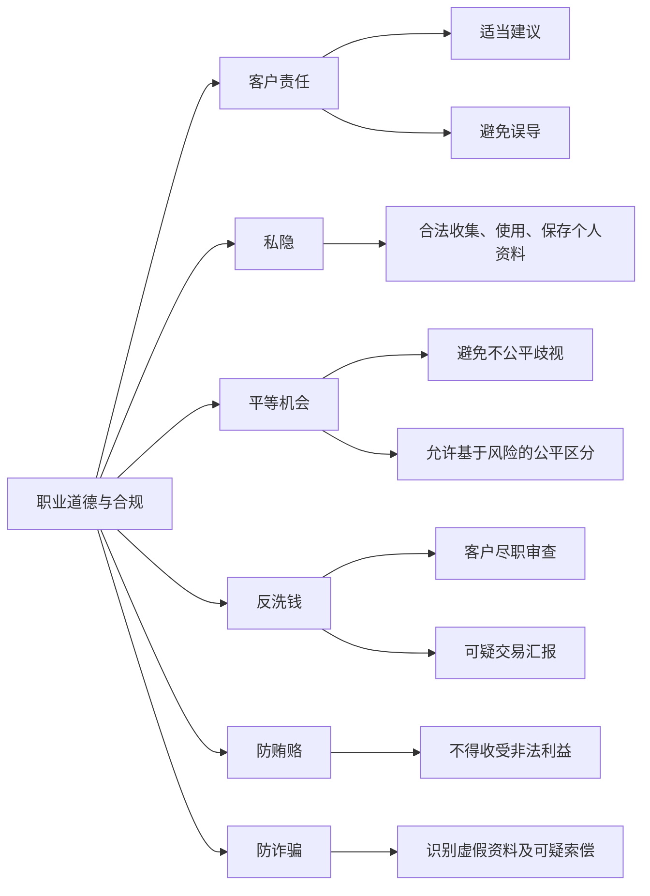

# 试卷一：保险原理及实务学习提纲

> 来源：`p1master.pdf`（友邦保险中介人牌照课程，试卷一：保险原理及实务，模拟试题及答案，2018 年 11 月版）。  
> 用途：按 PDF 题库整理的复习提纲、知识库图表与高频考点清单。请同时遵守原 PDF 的使用条款与内部资料限制。

## 1. 考试与复习总览

### 1.1 考试结构

| 项目 | 内容 |
|---|---|
| 考试形式 | 选择题 |
| 考试时间 | 2 小时 |
| 题数 | 75 题 |
| 合格线 | 70%，即答对 53 题 |
| 应考物品 | 身份证明文件、HB 铅笔、擦胶 |
| 时间要求 | 建议考前 10 分钟到场；迟到 15 分钟按缺席处理 |

### 1.2 章节权重与复习优先级

| 优先级 | 章次 | 主题 | 考试比重 | 估计题数 | 复习策略 |
|---:|---|---|---:|---:|---|
| 1 | 第 3 章 | 保险原则 | 30% | 22-23 | 必须完整掌握；大量计算、判断、例子题 |
| 2 | 第 6 章 | 保险业规管架构 | 21% | 16 | 记清机构、守则、投诉机制、中介人定义 |
| 3 | 第 2 章 | 法律原则 | 16% | 12 | 合约法与代理法是核心 |
| 4 | 第 1 章 | 风险及保险 | 12% | 9 | 概念题多，适合快速拿分 |
| 5 | 第 4 章 | 保险公司的主要功能 | 9% | 6-7 | 部门职责题，靠表格记忆 |
| 6 | 第 7 章 | 职业道德及其他问题 | 7% | 5-6 | 私隐、歧视、洗钱、贿赂、诈骗 |
| 7 | 第 5 章 | 香港保险业结构 | 5% | 4 | 题少但细节杂，抽样复习 |

### 1.3 高频考点提示

以下统计是从 PDF 题库的“参考章节”抽取而来，用于判断题库出现频率，不等同于官方考试题数。

| 章次 | 高频参考章节 | 主要主题 |
|---|---|---|
| 第 1 章 | 1.1.3、1.1.1、1.2 | 风险管理、风险定义、保险功能 |
| 第 2 章 | 2.1.3、2.2.6、2.1.2、2.2.3 | 简单合约要素、代理关系终止、合约类型、代理权限 |
| 第 3 章 | 3.1.4、3.4.7、3.2.2、3.6.4、3.3.3 | 可保权益、彌偿限制、最高诚信、代位限制、近因 |
| 第 4 章 | 4.5、4.7 | 核保、理赔 |
| 第 5 章 | 5.1.1、5.1.2、5.1.3、5.5.1 | 保险业务分类、市场组织 |
| 第 6 章 | 6.1.1、6.2.1、6.1.2、6.1.4、6.2.3 | 保险业条例、中介人、承保商专业守则、投诉局、经纪 |
| 第 7 章 | 7.2.1、7.1、7.1.1、7.3.1、7.3.2、7.4.6 | 私隐、经纪/代理责任、歧视、反洗钱 |

---

## 2. 知识库总图

---

## 3. 第 1 章：风险及保险

### 3.1 学习目标

掌握“风险”和“保险”的基本关系：保险不是消除风险，而是把某些可保风险的财务后果转移给保险人。

### 3.2 重点提纲

| 小节 | 重点 | 必背判断 |
|---|---|---|
| 1.1 | 风险与保险关系 | 并非所有风险都可保；保险只是应付风险的一种方法 |
| 1.1.1 | 风险定义 | 风险是与潜在损失有关的不确定性；可保损失通常需能以金钱衡量 |
| 1.1.1 注 | “风险”一词多义 | 可指损失可能性、受保财产、危险、承保对象 |
| 1.1.2a | 纯粹风险与投机风险 | 纯粹风险只有损失或无损失；投机风险有收益或损失 |
| 1.1.2b | 基本风险与特定风险 | 基本风险影响广泛；特定风险影响个别人士或少数对象 |
| 1.1.3 | 风险管理 | 识别风险、评估风险、处理风险；保险是风险转移工具 |
| 1.2(a) | 保险基本功能 | 财务补偿、风险转移 |
| 1.2(b) | 保险辅助功能 | 就业、损失防范、储蓄投资、促进经济活动 |

### 3.3 易错点

| 易错命题 | 正确理解 |
|---|---|
| “所有风险都可保” | 错。商业保险通常只承保可量化、可估算、符合法律及保险原则的风险 |
| “情绪上的悲伤可保” | 通常不可保，因为不能精确以金钱衡量 |
| “纯粹风险一定不可保” | 错。纯粹风险通常更适合保险；投机风险通常不可保 |
| “基本风险一定可保” | 不一定。战争、饥荒、大规模灾难常被排除或需特别安排 |

### 3.4 速记

- 可保风险倾向：财务损失、身体损失、法律认可利益。
- 不可保风险倾向：纯情绪损失、投机获利机会、违法事项、过分广泛或不可估量风险。
- 保险的核心：把不确定损失的财务后果集中、分散和转移。

---

## 4. 第 2 章：法律原则

### 4.1 知识图

### 4.2 合约法提纲

| 小节 | 重点 | 必背判断 |
|---|---|---|
| 2.1.1 | 合约定义 | 合约是法律上可强制执行的协议 |
| 2.1.2 | 简单合约 | 可书面、口头或由行为推定；保险合约通常属于简单合约 |
| 2.1.2(b) | 契据 | 较正式，需符合法定形式；保险中较少见 |
| 2.1.3 | 有效简单合约要素 | 要约、承约、代价、订约行为能力、合法性、订立法律关系意向、形式 |
| 2.1.3(a) | 要约 | 提出合约条件的一方为要约人 |
| 2.1.3(b) | 承约/反要约 | 修改原要约通常构成反要约，不是承约 |
| 2.1.3(c) | 代价 | 被保险人通常付保费；保险人承诺按保单赔付 |
| 2.1.3(d) | 订约行为能力 | 未成年人、精神无行为能力者等可能受限制 |
| 2.1.3(e) | 合法性 | 合约目的必须合法 |
| 2.1.3(f) | 法律关系意向 | 社交安排通常没有；商业安排通常有 |

### 4.3 代理法提纲

| 小节 | 重点 | 必背判断 |
|---|---|---|
| 2.2 | 代理法基础 | 代理人代表委托人与第三者建立法律关系 |
| 2.2(a) | 代理人与经纪 | 保险代理人通常代表保险人；保险经纪通常代表客户 |
| 2.2(b) | 追认 | 委托人可事后批准未获授权的行为 |
| 2.2(c) | 转承责任 | 委托人可能因代理人的授权行为承担责任 |
| 2.2.1 | 代理关系成立 | 需要委托人、代理人、第三者三方关系 |
| 2.2.2 | 委任方式 | 明示、默示、追认等 |
| 2.2.3 | 代理权限 | 实际权限、表面权限、必要代理、不容反悔 |
| 2.2.4 | 代理人责任 | 服从指示、亲自履行、谨慎、诚信、不图秘密利益、报账 |
| 2.2.5 | 委托人责任 | 支付约定报酬，偿付合理及授权开支 |
| 2.2.6 | 代理终止 | 双方同意、撤销、违约、期限届满、死亡、破产等 |

### 4.4 易错点

| 易错命题 | 正确理解 |
|---|---|
| “保险合约必须书面才有效” | 通常不是。保险合约多为简单合约，可由口头或行为成立，但实际保单文件很重要 |
| “反要约等于承约” | 错。反要约会取代原要约 |
| “代理人可随意委任分代理人” | 错。除非获授权、惯例允许或情况必要 |
| “代理关系只能因双方同意终止” | 错。也可因撤销、违约、死亡、破产、期限届满等终止 |

---

## 5. 第 3 章：保险原则

第 3 章是全卷最重要章节，题库覆盖最密集，必须作为主攻章节。

### 5.1 六大保险原则总图

### 5.2 可保权益

| 小节 | 重点 | 必背判断 |
|---|---|---|
| 3.1 | 可保权益总论 | 投保人与保险标的之间必须有法律认可关系 |
| 3.1.1 | 定义 | 对标的具有利益，标的安全则受益，损毁则受损 |
| 3.1.2 | 无可保权益 | 保险可能无效或不能执行，且可能近似赌博 |
| 3.1.3 | 必要条件 | 有可受保标的、与标的有法律认可关系、损失会带来财务损害 |
| 3.1.4 | 财产保险 | 所有人、抵押权人、保管人、承租人等可能有可保权益 |
| 3.1.5 | 人寿保险 | 寿险通常在投保时需要可保权益；人寿保单具有资产性质 |
| 3.1.6 | 转让 | 转让是把合约权益转给他人；人寿保单和水险保单通常较可自由转让 |

### 5.3 最高诚信

| 小节 | 重点 | 必背判断 |
|---|---|---|
| 3.2 | 最高诚信总论 | 保险合约比一般商业合约更强调主动披露 |
| 3.2.1 | 一般诚信 | 只需诚实回答已问问题，未被问到的通常可沉默 |
| 3.2.2 | 最高诚信适用 | 保险双方需披露重要事实；但可由保单条款调整 |
| 3.2.3 | 重要事实 | 会影响审慎保险人是否承保、保费或条款的事实 |
| 3.2.4 | 责任时间 | 通常在订约前及续保/变更时特别重要 |
| 3.2.5 | 违反方式 | 不披露、失实陈述，均可分欺诈性与非欺诈性 |
| 3.2.6 | 补救 | 保险人可按情况撤销合约、拒绝赔偿等 |

### 5.4 近因

| 小节 | 重点 | 必背判断 |
|---|---|---|
| 3.3 | 近因重要性 | 保单有承保危险与除外危险，必须找出有效成因 |
| 3.3.1 | 定义 | 近因不是时间上最近，而是最有效、最主导的成因 |
| 3.3.2 | 危险分类 | 承保危险、除外危险、未列明危险 |
| 3.3.3 | 应用 | 单一成因较简单；多重成因需判断主导链条 |
| 3.3.4 | 保单条文 | “直接或间接”字眼可扩大除外责任范围 |

### 5.5 彌偿

| 小节 | 重点 | 必背判断 |
|---|---|---|
| 3.4 | 彌偿总论 | 赔偿目的在于恢复损失前财务状况，不让被保险人获利 |
| 3.4.1 | 基本定义 | 对实际损失作精确财务补偿 |
| 3.4.2 | 适用范围 | 一般财产及责任保险适用；人寿及人身意外通常不适用 |
| 3.4.3 | 利益保单 | 人寿、人身意外按约定利益赔付 |
| 3.4.4 | 彌偿方式 | 现金最常见，也可维修、更换、恢复原状 |
| 3.4.5 | 损余 | 损坏标的仍有剩余价值，赔偿时需计入 |
| 3.4.6 | 委付 | 被保险人把损余交给保险人，以索取全损赔偿；水险尤其重要 |
| 3.4.7 | 彌偿限制 | 保额不足、平均条款、免赔额、起赔额、保单限额 |
| 3.4.8 | 超越严格彌偿 | 重置保险、以新代旧、约定价值、水险保单等 |

### 5.6 分担

| 小节 | 重点 | 必背判断 |
|---|---|---|
| 3.5 | 分担总论 | 来自彌偿原则，避免被保险人从多份保单获利 |
| 3.5.1 | 重复保险 | 多个保险人保障同一利益、同一标的、同一危险、同一损失 |
| 3.5.3 | 分担条件 | 多份有效彌偿保单、同一被保险人、同一标的/利益/危险/损失 |
| 3.5.4 | 不适用情况 | 人寿保险通常不适用，因为不是彌偿保险 |
| 3.5.5 | 条款修改 | 非水险保单可用保单条款调整普通法分担规则 |

### 5.7 代位

| 小节 | 重点 | 必背判断 |
|---|---|---|
| 3.6 | 代位总论 | 与分担目标相似：防止获利，维护彌偿原则 |
| 3.6.1 | 定义 | 保险人赔付后，承继被保险人向第三者追偿的权利 |
| 3.6.2 | 产生方式 | 普通法、合约条款、法规均可能产生代位 |
| 3.6.3 | 适用前提 | 通常适用于彌偿保险，并在保险人赔付后行使 |
| 3.6.4 | 限制 | 保险人追偿利益受已赔金额、保单限额、免赔额、被保险人未获足额彌偿等影响 |

### 5.8 第 3 章复习口诀

- 可保权益：先问“我和标的有没有法律认可关系？”
- 最高诚信：再问“重要事实有没有如实披露？”
- 近因：出险后问“真正有效导致损失的原因是什么？”
- 彌偿：赔多少，目标是“回到损失前”，不是赚钱。
- 分担：多张保单一起赔，保险人之间分摊。
- 代位：保险人赔了以后，代替被保险人向第三者追偿。

---

## 6. 第 4 章：保险公司的主要功能

### 6.1 部门职责表

| 小节 | 部门/功能 | 主要职责 | 常考判断 |
|---|---|---|---|
| 4.1 | 产品开发 | 设计新产品、评估市场、调整保障及价格 | 产品有竞争寿命，需要持续更新 |
| 4.2 | 客户服务 | 查询、投诉、文件、联络、售后服务 | 与公共关系有交叉，但以服务保单持有人为主 |
| 4.3 | 市场推广/公共关系 | 广告、赞助、品牌、公关活动 | 不等同核保或理赔 |
| 4.4 | 销售 | 销售成果、趋势、渠道支持 | 与市场推广关系密切 |
| 4.5 | 核保 | 选择风险、厘定条款、保费、限额及除外责任 | 本章最高频；寿险可集中核保 |
| 4.6 | 保单服务 | 制备、核实、签发、续保、修改保单文件 | 人寿保单文件尤其重要 |
| 4.7 | 理赔 | 验证保障、损失、近因、赔偿金额、反欺诈 | 本章高频；一般保险与寿险理赔关注点不同 |
| 4.8 | 再保险 | 保险人把部分风险转移给再保险人 | 不改变原保险人与被保险人的合约关系 |
| 4.9 | 精算 | 保费率、准备金、负债估值、长期产品评估 | 与寿险关系尤其紧密 |
| 4.10 | 会计及投资 | 收付款、记录、投资资产、财务管理 | 不负责核保决定 |
| 4.11 | 培训及发展 | 培训、教育、合规持续发展 | 培训与教育有联系但不完全相同 |

### 6.2 核保与理赔图

---

## 7. 第 5 章：香港保险业结构

### 7.1 重点提纲

| 小节 | 重点 | 必背判断 |
|---|---|---|
| 5.1.1 | 法定业务分类 | 《保险业条例》将保险业务分为长期业务与一般业务 |
| 5.1.2 | 传统分类 | 英式分类常见为寿险、意外、火险、海上等；美式分类方式不同 |
| 5.1.3 | 学术/功能分类 | 可按保障功能、业务性质、标的等分类 |
| 5.1.4 | 再保险分类 | 分出再保险是把风险转出；分入再保险是接受他人转来的风险 |
| 5.2.1 | 保险人 | 香港可有长期、一般、综合业务保险人 |
| 5.2.2 | 保险中介人 | 包括保险代理人及保险经纪 |
| 5.3 | 香港市场 | 香港是国际金融服务中心，市场国际化程度高 |
| 5.4 | 中介人要求 | 保险中介人须按制度注册、获授权或符合监管要求 |
| 5.5.1 | 香港保险业联会 | 行业组织，推进行业自律及专业标准 |
| 5.5.2 | 保险经纪团体 | 认可经纪团体须符合法定及监管要求 |
| 5.5.3 | 香港汽车保险局 | 涉及汽车保险补偿安排，资金来自相关市场机制 |

### 7.2 易错点

| 易错命题 | 正确理解 |
|---|---|
| “长期业务就是所有长期持有的保险” | 不准确。应按《保险业条例》分类，而非保单持有时间的日常理解 |
| “再保险人直接向原被保险人负责” | 通常不是。原保险合约仍在原保险人与被保险人之间 |
| “代理人和经纪代表同一方” | 错。代理人通常代表保险人，经纪通常代表客户 |

---

## 8. 第 6 章：保险业规管架构

### 8.1 规管架构图

### 8.2 重点提纲

| 小节 | 重点 | 必背判断 |
|---|---|---|
| 6.1.1 | 《保险业条例》 | 规管保险人授权、财务要求、适当人选、市场秩序等 |
| 6.1.2 | 承保商专业守则 | 由行业组织执行，涉及核保、产品、索偿等良好保险做法 |
| 6.1.3 | 处理投诉指引 | 要求保险人建立投诉处理程序，并向投诉人说明处理方式 |
| 6.1.4 | 保险投诉局 | 取代旧“保险索偿投诉局”；提供替代纠纷解决机制 |
| 6.2 | 中介人规管总论 | 中介人须受法定、守则及资格要求规管 |
| 6.2.1 | 保险代理人 | 代表一名或多名保险人，就保险合约提供意见或安排合约 |
| 6.2.2 | 代理管理守则 | 涉及代理人的登记、资格、操守、培训等 |
| 6.2.3 | 保险经纪 | 代表客户，需符合最低要求，并受认可团体或监管机制约束 |

### 8.3 关键区别

| 项目 | 保险代理人 | 保险经纪 |
|---|---|---|
| 通常代表 | 保险人 | 客户/投保人 |
| 法律关系重点 | 代理法下代表保险人行事 | 为客户寻求保险安排及意见 |
| 常考点 | 法定定义、代表对象、代理责任 | 名称使用、最低要求、认可团体 |

### 8.4 版本提示

PDF 明确提示：保险索偿投诉局已自 2018 年 1 月 16 日起改名为保险投诉局。复习时应以 PDF 指定版本内容为准；若用于真实应考，请另外核对最新监管制度。

---

## 9. 第 7 章：职业道德及其他有关问题

### 9.1 重点提纲

| 小节 | 重点 | 必背判断 |
|---|---|---|
| 7.1 | 中介人对保单持有人责任 | 诚实、专业、适当建议、避免误导、处理利益冲突 |
| 7.1.1 | 保险经纪责任 | 代表客户利益，注意错误及遗漏风险 |
| 7.1.2 | 保险代理人责任 | 代表保险人，同时需公平对待客户、不得误导 |
| 7.2 | 个人资料私隐 | 受《个人资料（私隐）条例》规管 |
| 7.2.1 | 私隐重点 | 个人资料、资料使用者、私隐专员、资料保障原则 |
| 7.3 | 平等机会 | 涉及性别、残疾、家庭岗位、种族等反歧视原则 |
| 7.3.1 | 不公平歧视 | 违法歧视需避免 |
| 7.3.2 | 公平歧视 | 保险可基于合理精算、统计、风险因素作差别处理 |
| 7.4 | 反洗钱 | 长期保险较易被利用作洗钱工具 |
| 7.4.3 | 高风险产品 | 具现金价值、可退保、可转让或投资性质的长期保险 |
| 7.4.4 | 洗钱阶段 | 放置、分层、整合 |
| 7.4.5 | 相关法例 | 追讨犯罪得益、恐怖分子资金筹集等 |
| 7.4.6 | 反洗钱指引 | 金融机构应建立反洗钱及恐怖分子资金筹集制度 |
| 7.5 | 防止贿赂 | 代理人不得索取或接受非法利益 |
| 7.6 | 保险诈骗 | 虚假索偿、协助客户诈骗均可构成严重问题 |
| 7.6.3 | 防诈骗步骤 | 身份核实、文件查验、异常交易警觉、内部汇报 |

### 9.2 合规风险图

---

## 10. 核心概念对照表

| 概念 | 一句话定义 | 常见考法 |
|---|---|---|
| 风险 | 与潜在损失有关的不确定性 | 判断哪些风险可保 |
| 纯粹风险 | 只有损失或无损失，没有获利可能 | 与投机风险比较 |
| 投机风险 | 有获利也有损失可能 | 通常不可保 |
| 基本风险 | 影响广泛群体或社会 | 战争、饥荒、大规模灾害 |
| 特定风险 | 影响个别人士或财产 | 通常较可保 |
| 简单合约 | 可由书面、口头或行为成立的合约 | 保险合约通常属于此类 |
| 要约 | 一方提出明确合约条件 | 反要约会取代原要约 |
| 代价 | 合约双方交换的价值 | 保费与赔付承诺 |
| 代理人 | 代表委托人与第三者建立法律关系的人 | 与经纪代表对象比较 |
| 可保权益 | 投保人与标的之间法律认可的利益关系 | 财产、人寿、转让 |
| 最高诚信 | 主动披露重要事实的责任 | 重要事实、不披露、失实陈述 |
| 近因 | 最有效、最主导的损失成因 | 不等于时间最近原因 |
| 彌偿 | 赔偿至损失前财务状态 | 与利益保单、超越彌偿比较 |
| 分担 | 多个保险人分摊同一损失 | 重复保险条件 |
| 代位 | 保险人赔付后承继追偿权 | 第三者疏忽、追偿限制 |
| 再保险 | 保险人把部分风险转给再保险人 | 不改变原保险合约 |
| 公平歧视 | 基于合理风险及统计的差别处理 | 与违法歧视比较 |
| 洗钱 | 隐藏犯罪得益来源的过程 | 放置、分层、整合 |

---

## 11. 答题策略

### 11.1 做题顺序

1. 先做第 1、4、5 章概念与部门职责题，快速拿分。
2. 再做第 2、6、7 章法例、责任、机构题，靠关键词判断。
3. 最后集中处理第 3 章，尤其是可保权益、最高诚信、近因、彌偿、分担、代位的例子题。

### 11.2 选择题判断模板

| 遇到题型 | 先问自己 |
|---|---|
| 风险是否可保 | 是否财务可量化？是否纯粹风险？是否合法？是否可大量分散？ |
| 合约是否有效 | 有没有要约、承约、代价、行为能力、合法性、法律关系意向？ |
| 代理人是否有权 | 是实际权限、表面权限、必要代理，还是事后追认？ |
| 可保权益 | 投保人与标的有无法律认可关系？何时需要证明？ |
| 最高诚信 | 是否重要事实？是否披露？有无失实陈述？是否欺诈？ |
| 近因 | 真正有效导致损失的是承保危险、除外危险还是未列明危险？ |
| 彌偿 | 赔付会不会让被保险人获利？是否有免赔额、平均条款、损余？ |
| 分担 | 是否多份有效彌偿保单保障同一损失？ |
| 代位 | 保险人是否已经赔付？是否有第三者可追偿？ |
| 规管题 | 题目问的是保险人、代理人、经纪、投诉局还是行业组织？ |

### 11.3 高频易混关键词

| 关键词 | 不要混淆 |
|---|---|
| 代理人 | 通常代表保险人 |
| 经纪 | 通常代表客户 |
| 近因 | 不是最近原因，而是有效主导原因 |
| 分担 | 保险人之间分摊 |
| 代位 | 保险人向第三者追偿 |
| 损余 | 损坏标的剩余价值 |
| 委付 | 把损余交给保险人以索取全损赔偿 |
| 免赔额 | 损失中由被保险人自负的部分 |
| 起赔额 | 达到门槛后才赔，具体按条款处理 |
| 重置/以新代旧 | 可能超越严格彌偿 |

---

## 12. 七天复习安排

| 天数 | 任务 | 目标 |
|---:|---|---|
| Day 1 | 第 1 章 + 第 5 章 | 建立基础概念，完成低权重章节 |
| Day 2 | 第 2 章合约法 | 背熟简单合约要素与例子 |
| Day 3 | 第 2 章代理法 | 掌握代理权限、责任、终止 |
| Day 4 | 第 3 章上半：可保权益、最高诚信、近因 | 完成三大原则的例题归类 |
| Day 5 | 第 3 章下半：彌偿、分担、代位 | 专攻计算和案例判断 |
| Day 6 | 第 4、6、7 章 | 部门职责、监管机构、合规问题 |
| Day 7 | 全卷模拟 + 错题整理 | 以 75 题/2 小时计时训练，错题按本提纲回填 |

---

## 13. 最后检查清单

- [ ] 我能说出 7 章的考试比重和优先级。
- [ ] 我能区分纯粹风险、投机风险、基本风险、特定风险。
- [ ] 我能列出有效简单合约的要素。
- [ ] 我能区分保险代理人与保险经纪。
- [ ] 我能解释可保权益，并判断财产、人寿、转让题。
- [ ] 我能判断重要事实、最高诚信违反及补救。
- [ ] 我能用近因分析单一成因和多重成因题。
- [ ] 我能处理彌偿、损余、委付、免赔额、平均条款题。
- [ ] 我能说明分担与代位的不同。
- [ ] 我能把保险公司部门与职责配对。
- [ ] 我能说出香港保险业主要规管、投诉及中介人机制。
- [ ] 我能处理私隐、歧视、洗钱、贿赂、诈骗题。

